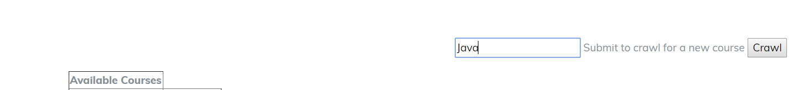
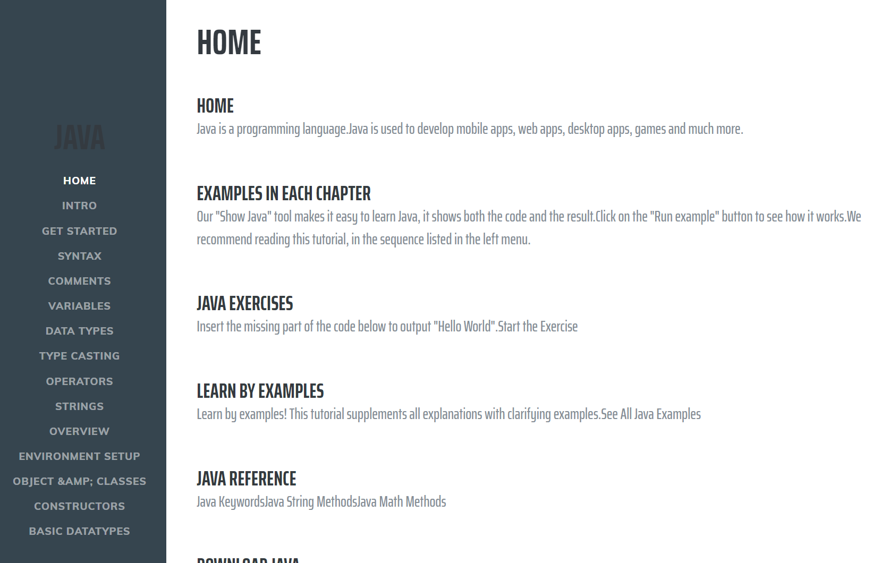

# Project Setup
1. Create an RDB and create tables using db/create.sql
2. Open application.properties and enter information of your RDB.
3. Run front-end as spring boot application (prefereably import them in eclipse as a maven project)
4. Go to localhost:8080

# course-crawler
Crawl sites to create course content

# Home page

# Crawl
Type your course name and click crawl.
The crawler will find information on that course if exists.

# Courses
You can check whether the crawling was successful by refreshing the page after some time.

# Course Info
Open the course information

